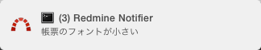
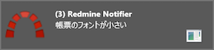
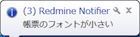
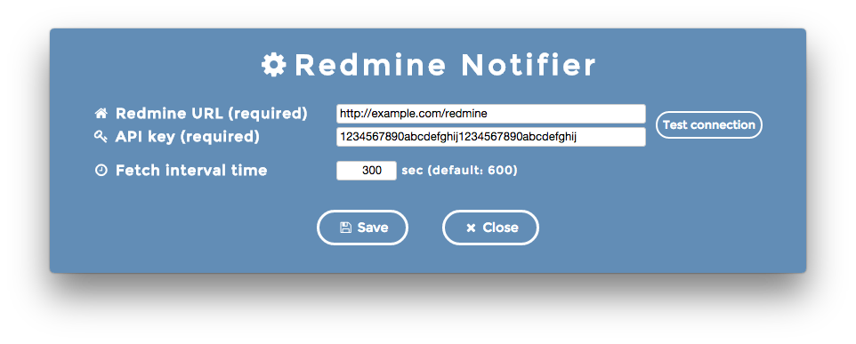

# Redmine Notifier

[](https://codeclimate.com/github/emsk/redmine-notifier)
[](https://gemnasium.com/emsk/redmine-notifier)
[](LICENSE)

Redmine Notifier is a simple updated issues checker that runs in the background.
It sends a desktop notification if there are any updates in issues.





The number of issues that were updated after previous fetch is shown in parentheses.
Also, the subject is shown only about the latest issue.

## Downloads

Installers for OS X and Windows can be found on the [releases](../../releases) page.

## Settings



The icon appears in the menu bar or task tray when Redmine Notifier is started.
Select "Preferences" in the context menu to open the settings window.

## Supported Redmine Versions

* Redmine 2.5.0 or higher

## Development

Redmine Notifier is powered by [Electron](http://electron.atom.io/), so we can develop it with web technologies.

### Dependencies

##### Production

* [node-notifier](https://github.com/mikaelbr/node-notifier)
* [notie](https://github.com/jaredreich/notie.js)

##### Development

* [electron-builder](https://github.com/loopline-systems/electron-builder)
* [electron-packager](https://github.com/maxogden/electron-packager)
* [electron-prebuilt](https://github.com/mafintosh/electron-prebuilt)

See `dependencies` and `devDependencies` in [`package.json`](package.json).

### Installing dependencies

```sh
cd /path/to/redmine-notifier
npm run prepare
```

### Starting app

```sh
npm start
```

### Building apps

```sh
npm run build
```

### Building installers

```sh
npm run pack
```

See `scripts` in [`package.json`](package.json) with regard to other commands.

## Contributing

1. Fork it ( https://github.com/emsk/redmine-notifier/fork )
2. Create your feature branch (`git checkout -b my-new-feature`)
3. Commit your changes (`git commit -am 'Add some feature'`)
4. Push to the branch (`git push origin my-new-feature`)
5. Create a new Pull Request

## License

[MIT](LICENSE)
